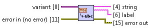

Container To String.vi
======================

Recursively converts almost* anything to human-readable** string. Result is as much compatible with Python built-in repr_ function as possible. This means that in most of the cases, resulting string can be directly procesed by Python interpreter, to get an object which corresponds to the one which was passed as an input argument to the VI.

Additionally, VI provides label assigned to the wire that provides data to the input.

.. _repr: https://docs.python.org/2/library/functions.html#func-repr

| [*] Following data types are not supported: numerical types with units.  
| [**] Except for `Variant` type which is flattened to non-readable string.  

**variant** *(Input, String)*
  Data to be converted into string.

**string** *(Output, String)*
  String representing input data.

**label** *(Output, String)*
  Label assigned to the wire that provides data to the **variant** input.

**error in** *(Input, Error Cluster)*
  This input provides standard `error in <https://zone.ni.com/reference/en-XX/help/371361L-01/lvconcepts/using_standard_error_in/>`_ functionality.

**error out** *(Output, Error Cluster)*
  This output provides standard `error out <http://zone.ni.com/reference/en-XX/help/371361N-01/lvconcepts/using_standard_error_out/>`_ functionality.

Basic Usage
-----------

.. raw:: html

    <table cellpadding=6>
      <tr>
        <th style="width: 310px;">Code</th>
        <th>Result</th> 
        <th>Comment</th>
      </tr>
      <tr>
        <td style="border-bottom: 1px solid #E0E0E0; text-align: right; vertical-align: middle;"></td>
        <td style="border-bottom: 1px solid #E0E0E0; text-align: left; vertical-align: top; font-family: monospace;">123.000000</td> 
        <td style="border-bottom: 1px solid #E0E0E0; text-align: left; vertical-align: top;">Input of the VI is a <cite>Variant</cite>. Whatever you connect to this input must be casted explicitely...</td>
      </tr>
      <tr>
        <td style="border-bottom: 1px solid #E0E0E0; text-align: right; vertical-align: middle;"></td>
        <td style="border-bottom: 1px solid #E0E0E0; text-align: left; vertical-align: top; font-family: monospace;">123.000000</td> 
        <td style="border-bottom: 1px solid #E0E0E0; text-align: left; vertical-align: top;">...or implicitely.</td>
      </tr>
      <tr>
        <td style="border-bottom: 1px solid #E0E0E0; text-align: right; vertical-align: middle;"></td>
        <td style="border-bottom: 1px solid #E0E0E0; text-align: left; vertical-align: top; font-family: monospace;">3.750000</td> 
        <td style="border-bottom: 1px solid #E0E0E0; text-align: left; vertical-align: top;">VI uses default formatting for all numerical data types. Data types with units are not supported.</td>
      </tr>
      <tr>
        <td style="border-bottom: 1px solid #E0E0E0; text-align: right; vertical-align: middle;"></td>
        <td style="border-bottom: 1px solid #E0E0E0; text-align: left; vertical-align: top; font-family: monospace;">True</td> 
        <td style="border-bottom: 1px solid #E0E0E0; text-align: left; vertical-align: top;">Boolean values are represented by <code class="docutils literal">False</code> and <code class="docutils literal">True</code> keywords known from Python and not <code class="docutils literal">FALSE</code> and <code class="docutils literal">TRUE</code> as it can be observed in LabVIEW.</td>
      </tr>
      <tr>
        <td style="border-bottom: 1px solid #E0E0E0; text-align: right; vertical-align: middle;"></td>
        <td style="border-bottom: 1px solid #E0E0E0; text-align: left; vertical-align: top; font-family: monospace;">Second</td> 
        <td style="border-bottom: 1px solid #E0E0E0; text-align: left; vertical-align: top;">In case of enums, VI shows names of the constants... </td>
      </tr>
      <tr>
        <td style="border-bottom: 1px solid #E0E0E0; text-align: right; vertical-align: middle;"></td>
        <td style="border-bottom: 1px solid #E0E0E0; text-align: left; vertical-align: top; font-family: monospace;">1</td> 
        <td style="border-bottom: 1px solid #E0E0E0; text-align: left; vertical-align: top;">...of course, unless you cast enum to numerical type.</td>
      </tr>
      <tr>
        <td style="border-bottom: 1px solid #E0E0E0; text-align: right; vertical-align: middle;"></td>
        <td style="border-bottom: 1px solid #E0E0E0; text-align: left; vertical-align: top; font-family: monospace;">LabVIEW Object</td> 
        <td style="border-bottom: 1px solid #E0E0E0; text-align: left; vertical-align: top;">Objects are represented by names of their classes.</td>
      </tr>
      <tr>
        <td style="border-bottom: 1px solid #E0E0E0; text-align: right; vertical-align: middle;"></td>
        <td style="border-bottom: 1px solid #E0E0E0; text-align: left; vertical-align: top; font-family: monospace;">0x4A000031</td> 
        <td style="border-bottom: 1px solid #E0E0E0; text-align: left; vertical-align: top;">References are shown as memory locations (32-bit hexadecimal addresses) which they correspond to.</td>
      </tr>
      <tr>
        <td style="border-bottom: 1px solid #E0E0E0; text-align: right; vertical-align: middle;"></td>
        <td style="border-bottom: 1px solid #E0E0E0; text-align: left; vertical-align: top; font-family: monospace;">'abc\ndef'</td> 
        <td style="border-bottom: 1px solid #E0E0E0; text-align: left; vertical-align: top;">Special characters in the strings are escaped. Quotation marks are added. This conforms behaviour of <code class="docutils literal">repr</code> function in Python.</td>
      </tr>
      <tr>
        <td style="border-bottom: 1px solid #E0E0E0; text-align: right; vertical-align: middle;"></td>
        <td style="border-bottom: 1px solid #E0E0E0; text-align: left; vertical-align: top; font-family: monospace;">'C:\'</td> 
        <td style="border-bottom: 1px solid #E0E0E0; text-align: left; vertical-align: top;">Paths as considered the same way as strings.</td>
      </tr>
      <tr>
        <td style="border-bottom: 1px solid #E0E0E0; text-align: right; vertical-align: middle;"></td>
        <td style="border-bottom: 1px solid #E0E0E0; text-align: left; vertical-align: top; font-family: monospace;">1904-01-01 12:00:00.000000</td> 
        <td style="border-bottom: 1px solid #E0E0E0; text-align: left; vertical-align: top;">Following default formatting string is applied to timestamps: <pre>%^<%Y-%m-%d %H:%M:%S%06u>T</pre> More details can be found <a href="http://zone.ni.com/reference/en-XX/help/371361H-01/glang/codes_for_time_format_str/">here</a>.</td>
      </tr>
      <tr>
        <td style="border-bottom: 1px solid #E0E0E0; text-align: right; vertical-align: middle;"></td>
        <td style="border-bottom: 1px solid #E0E0E0; text-align: left; vertical-align: top; font-family: monospace;"><i>non-printable</i></td> 
        <td style="border-bottom: 1px solid #E0E0E0; text-align: left; vertical-align: top;"><cite>Variants</cite> are flattened to strings the same way as LabVIEW built-in function <code class="docutils literal">Variant To Flattened String</code> would do.</td>
      </tr>
      <tr>
        <td style="border-bottom: 1px solid #E0E0E0; text-align: right; vertical-align: middle;"></td>
        <td style="border-bottom: 1px solid #E0E0E0; text-align: left; vertical-align: top; font-family: monospace;"><i>non-printable</i></td> 
        <td style="border-bottom: 1px solid #E0E0E0; text-align: left; vertical-align: top;">Double occurence of <code class="docutils literal">To Variant</code> function can be substituted by <a href="to_nested_variant.html">To Nested Variant.vi</a>.</td>
      </tr>
      <tr>
        <td style="border-bottom: 1px solid #E0E0E0; text-align: right; vertical-align: middle;"></td>
        <td style="border-bottom: 1px solid #E0E0E0; text-align: left; vertical-align: top; font-family: monospace;">[[1, 2, 3], [6, 7, 8]]</td> 
        <td style="border-bottom: 1px solid #E0E0E0; text-align: left; vertical-align: top;">Arrays are displayed row by row, the same way as nested lists in Python.</td>
      </tr>
      <tr>
        <td style="border-bottom: 1px solid #E0E0E0; text-align: right; vertical-align: middle;"></td>
        <td style="border-bottom: 1px solid #E0E0E0; text-align: left; vertical-align: top; font-family: monospace;">{'foo': 123, 'bar': False}</td> 
        <td style="border-bottom: 1px solid #E0E0E0; text-align: left; vertical-align: top;">Cluster, elements of which have <u>non-empty</u> labels is printed as a <cite>dictionary</cite> in Python.</td>
      </tr>
      <tr>
        <td style="border-bottom: 1px solid #E0E0E0; text-align: right; vertical-align: middle;"></td>
        <td style="border-bottom: 1px solid #E0E0E0; text-align: left; vertical-align: top; font-family: monospace;">{123, False}</td> 
        <td style="border-bottom: 1px solid #E0E0E0; text-align: left; vertical-align: top;">Cluster, elements of which have <u>empty</u> labels is printed as a <cite>set</cite> in Python.</td>
      </tr>
      <tr>
        <td style="border-bottom: 1px solid #E0E0E0; text-align: right; vertical-align: middle;"></td>
        <td style="border-bottom: 1px solid #E0E0E0; text-align: left; vertical-align: top; font-family: monospace;">[0.000000, 0.062791, 0.125333, ... -0.187381, -0.125333, -0.062791]</td> 
        <td style="border-bottom: 1px solid #E0E0E0; text-align: left; vertical-align: top;">In case of <cite>Waveforms</cite>, only data is converted to string. The same applies to <cite>Digital Waveforms</cite> and <cite>Digital Data</cite> types. Note that three dots on the left denote part of the string which hasn't been presented here, but is returned by the VI.</td>
      </tr>
    </table>

Advanced Usage
--------------

.. raw:: html

    <table cellpadding=6>
      <tr>
        <th style="width: 310px;">Code</th>
        <th>Result</th> 
        <th>Comment</th>
      </tr>
      <tr>
        <td style="border-bottom: 1px solid #E0E0E0; text-align: right; vertical-align: middle;"></td>
        <td style="border-bottom: 1px solid #E0E0E0; text-align: left; vertical-align: top; font-family: monospace;">[True, [[1, 2, 3], [6, 7, 8]]]</td> 
        <td style="border-bottom: 1px solid #E0E0E0; text-align: left; vertical-align: top;">Heterogeneous arrays are supported too. Each element of such array must be a <cite>Variant</cite>.</td>
      </tr>
      <tr>
        <td style="border-bottom: 1px solid #E0E0E0; text-align: right; vertical-align: middle;"></td>
        <td style="border-bottom: 1px solid #E0E0E0; text-align: left; vertical-align: top; font-family: monospace;">{8.000000, {'status': True, 'code': -1, 'source': 'Error'}, [False, True, False]}</td> 
        <td style="border-bottom: 1px solid #E0E0E0; text-align: left; vertical-align: top;">Nested clusters correspond to nested <cite>dictionaries</cite> and <cite>sets</cite> in Python. Note that labels of the elements can be hidden, but will still appear in the string if they are non-empty.</td>
      </tr>
    </table>

