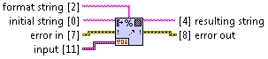

Format Container Into String.vi
===============================

Converts input data into a human-readable string according the the `format string`. Input data can be of any type, except for those few which are not supported by `Container To String.vi <container_to_string.html>`_.

**format string** *(Input, String)*
  Optional string that specifies how to create resulting string.

**initial string** *(Input, String)*
  String to be prepended to the resulting string.

**error in** *(Input, Error Cluster)*
  This input provides standard `error in <https://zone.ni.com/reference/en-XX/help/371361L-01/lvconcepts/using_standard_error_in/>`_ functionality.

**input** *(Input, Variant)*
  Data to be formated into string.

**resulting string** *(Output, String)*
  String representing input data, build based on format string.

**error out** *(Output, Error Cluster)*
  This output provides standard `error out <http://zone.ni.com/reference/en-XX/help/371361N-01/lvconcepts/using_standard_error_out/>`_ functionality.

Theory of Operation
-------------------

Following two types of formating are available:

* **Explicite** - data item has corresponding placeholder which specifies how value is to be converted into string. This is available only for LabVIEW built-in scalar types. Standard placeholders like ``%f``, ``%d`` etc can be used. For more information read `here <http://zone.ni.com/reference/en-XX/help/371361J-01/lvconcepts/format_specifier_syntax/>`_.
* **Implicite** - available for all data types that are supported by `Container To String.vi <container_to_string.html>`_. It can be achieved in two ways:
    * **Default** - by not providing `format string` at all. Data needs to be casted (manually or automatically) to `Variant` type and provided to the input of the VI. This will have the same effect as using `Container To String.vi <container_to_string.html>`_.
    * **Custom** - by casting data to `Variant` twice and applying ``%s`` placeholder. The same formating as above will be used. However here, additional text can be prepended or appended.

Additional rules apply to the containers (arrays and clusters). Each element of the container is considered separately and formated either explicitely or implicitely. Multidimentional arrays are first converted to single dimention. Clusters cannot be linearized like this. They are processed element-wise, non-recursively.

Number of elements and placeholders doesn't have to be the same. If number of elements is greater than number of placeholders, the last elements will be discarded. If number of elements is smaller than number of placeholders, the last placeholders will be discarded.

Scalars
-------

.. raw:: html

    <table cellpadding=6>
      <tr>
        <th style="width: 400px;">Code</th>
        <th>Result</th> 
        <th>Comment</th>
      </tr>
      <tr>
        <td style="border-bottom: 1px solid #E0E0E0; text-align: right; vertical-align: middle;"></td>
        <td style="border-bottom: 1px solid #E0E0E0; text-align: left; vertical-align: top; font-family: monospace;">1.230000</td> 
        <td style="border-bottom: 1px solid #E0E0E0; text-align: left; vertical-align: top;"><b>Implicite default formatting.</b> Built-in type, scalar. Data casted to <cite>Variant</cite> manually.</td>
      </tr>
      <tr>
        <td style="border-bottom: 1px solid #E0E0E0; text-align: right; vertical-align: middle;"></td>
        <td style="border-bottom: 1px solid #E0E0E0; text-align: left; vertical-align: top; font-family: monospace;">1.230000</td> 
        <td style="border-bottom: 1px solid #E0E0E0; text-align: left; vertical-align: top;"><b>Implicite default formatting.</b> Built-in type, scalar. Data casted to <cite>Variant</cite> automatically.</td>
      </tr>
      <tr>
        <td style="border-bottom: 1px solid #E0E0E0; text-align: right; vertical-align: middle;"></td>
        <td style="border-bottom: 1px solid #E0E0E0; text-align: left; vertical-align: top; font-family: monospace;">1.230000</td> 
        <td style="border-bottom: 1px solid #E0E0E0; text-align: left; vertical-align: top;"><b>Implicite custom formatting.</b> Built-in type, scalar. Note that data has ben casted to <cite>Variant</cite> twice.</td>
      </tr>
      <tr>
        <td style="border-bottom: 1px solid #E0E0E0; text-align: right; vertical-align: middle;"></td>
        <td style="border-bottom: 1px solid #E0E0E0; text-align: left; vertical-align: top; font-family: monospace;">1.230000</td> 
        <td style="border-bottom: 1px solid #E0E0E0; text-align: left; vertical-align: top;"><b>Implicite custom formatting.</b> Built-in type, scalar. The same as above, but double casting has been performed by <a href="to_nested_variant.html">To Nested Variant.vi</a>.</td>
      </tr>
      <tr>
        <td style="border-bottom: 1px solid #E0E0E0; text-align: right; vertical-align: middle;"></td>
        <td style="border-bottom: 1px solid #E0E0E0; text-align: left; vertical-align: top; font-family: monospace;">Value: 1.230000</td> 
        <td style="border-bottom: 1px solid #E0E0E0; text-align: left; vertical-align: top;"><b>Explicite formatting</b>. Built-in type, scalar. Simple case.</td>
      </tr>
      <tr>
        <td style="border-bottom: 1px solid #E0E0E0; text-align: right; vertical-align: middle;"></td>
        <td style="border-bottom: 1px solid #E0E0E0; text-align: left; vertical-align: top; font-family: monospace;">Value: 1.230</td> 
        <td style="border-bottom: 1px solid #E0E0E0; text-align: left; vertical-align: top;"><b>Explicite formatting.</b> Built-in type, scalar. A bit more advanced than above.</td>
      </tr>
      <tr>
        <td style="border-bottom: 1px solid #E0E0E0; text-align: right; vertical-align: middle;"></td>
        <td style="border-bottom: 1px solid #E0E0E0; text-align: left; vertical-align: top; font-family: monospace;">LabVIEW Object</td> 
        <td style="border-bottom: 1px solid #E0E0E0; text-align: left; vertical-align: top;"><b>Implicite custom formatting.</b> Instance of the class.</td>
      </tr>
      <tr>
        <td style="border-bottom: 1px solid #E0E0E0; text-align: right; vertical-align: middle;"></td>
        <td style="border-bottom: 1px solid #E0E0E0; text-align: left; vertical-align: top; font-family: monospace;">[[1.000000, 2.000000, 3.000000], [6.000000, 7.000000, 8.000000]]</td> 
        <td style="border-bottom: 1px solid #E0E0E0; text-align: left; vertical-align: top;"><b>Implicite default formatting.</b> Array.</td>
      </tr>
    </table>

Special Cases
-------------

.. raw:: html

    <table cellpadding=6>
      <tr>
        <th style="width: 400px;">Code</th>
        <th>Result</th> 
        <th>Comment</th>
      </tr>
      <tr>
        <td style="border-bottom: 1px solid #E0E0E0; text-align: right; vertical-align: middle;"></td>
        <td style="border-bottom: 1px solid #E0E0E0; text-align: left; vertical-align: top; font-family: monospace;">1</td> 
        <td style="border-bottom: 1px solid #E0E0E0; text-align: left; vertical-align: top;">Natively, LabVIEW can convert boolean values as they were decimal...</td>
      </tr>
      <tr>
        <td style="border-bottom: 1px solid #E0E0E0; text-align: right; vertical-align: middle;"></td>
        <td style="border-bottom: 1px solid #E0E0E0; text-align: left; vertical-align: top; font-family: monospace;">TRUE</td> 
        <td style="border-bottom: 1px solid #E0E0E0; text-align: left; vertical-align: top;">...or as they were stirngs. This returns names of the values in upper case though.</td>
      </tr>
      <tr>
        <td style="border-bottom: 1px solid #E0E0E0; text-align: right; vertical-align: middle;"></td>
        <td style="border-bottom: 1px solid #E0E0E0; text-align: left; vertical-align: top; font-family: monospace;">True</td> 
        <td style="border-bottom: 1px solid #E0E0E0; text-align: left; vertical-align: top;">If we want to be Python-compatible, we need CamelCase. This can be achieved by using <b>implicite custom formatting</b>.</td>
      </tr>
      <tr>
        <td style="border-bottom: 1px solid #E0E0E0; text-align: right; vertical-align: middle;"></td>
        <td style="border-bottom: 1px solid #E0E0E0; text-align: left; vertical-align: top; font-family: monospace;">second</td> 
        <td style="border-bottom: 1px solid #E0E0E0; text-align: left; vertical-align: top;">Enums can be converted by using names of the constants... </td>
      </tr>
      <tr>
        <td style="border-bottom: 1px solid #E0E0E0; text-align: right; vertical-align: middle;"></td>
        <td style="border-bottom: 1px solid #E0E0E0; text-align: left; vertical-align: top; font-family: monospace;">1</td> 
        <td style="border-bottom: 1px solid #E0E0E0; text-align: left; vertical-align: top;">...or by using values of the constants.</td>
      </tr>
      <tr>
        <td style="border-bottom: 1px solid #E0E0E0; text-align: right; vertical-align: middle;"></td>
        <td style="border-bottom: 1px solid #E0E0E0; text-align: left; vertical-align: top; font-family: monospace;">Value of second is 1</td> 
        <td style="border-bottom: 1px solid #E0E0E0; text-align: left; vertical-align: top;">The same constant is dispayed twice. Once as a name and then as a value.</td>
      </tr>
      <tr>
        <td style="border-bottom: 1px solid #E0E0E0; text-align: right; vertical-align: middle;"></td>
        <td style="border-bottom: 1px solid #E0E0E0; text-align: left; vertical-align: top; font-family: monospace;">abc def</td> 
        <td style="border-bottom: 1px solid #E0E0E0; text-align: left; vertical-align: top;"><code class="docutils literal">s</code> placeholder is the one which natively goes together with string data type. This is why it returns input data as it is. This case can be clasified as <b>explicite formatting</b>.</td>
      </tr>
      <tr>
        <td style="border-bottom: 1px solid #E0E0E0; text-align: right; vertical-align: middle;"></td>
        <td style="border-bottom: 1px solid #E0E0E0; text-align: left; vertical-align: top; font-family: monospace;">'abc\ndef'</td> 
        <td style="border-bottom: 1px solid #E0E0E0; text-align: left; vertical-align: top;">If we want to be compatible wiht Python <code class="docutils literal">repr</code> function, string data type needs to be provided in a variant. This results in <b>implicite custom formatting</b>.</td>
      </tr>
      <tr>
        <td style="border-bottom: 1px solid #E0E0E0; text-align: right; vertical-align: middle;"></td>
        <td style="border-bottom: 1px solid #E0E0E0; text-align: left; vertical-align: top; font-family: monospace;"><i>non-printable</i></td> 
        <td style="border-bottom: 1px solid #E0E0E0; text-align: left; vertical-align: top;">In cases when we need <cite>Variant</cite> type to be flattened into string, triple casting is necessary.</td>
      </tr>
    </table>

Containers
----------

.. raw:: html

    <table cellpadding=6>
      <tr>
        <th style="width: 400px;">Code</th>
        <th>Result</th> 
        <th>Comment</th>
      </tr>
      <tr>
        <td style="border-bottom: 1px solid #E0E0E0; text-align: right; vertical-align: middle;"></td>
        <td style="border-bottom: 1px solid #E0E0E0; text-align: left; vertical-align: top; font-family: monospace;">[1, 2, 3]</td> 
        <td style="border-bottom: 1px solid #E0E0E0; text-align: left; vertical-align: top;"><b>Implicite defaut formatting</b> of homogenous array.</td>
      </tr>
      <tr>
        <td style="border-bottom: 1px solid #E0E0E0; text-align: right; vertical-align: middle;"></td>
        <td style="border-bottom: 1px solid #E0E0E0; text-align: left; vertical-align: top; font-family: monospace;">1..2..3..</td> 
        <td style="border-bottom: 1px solid #E0E0E0; text-align: left; vertical-align: top;"><b>Element-wise explicite formatting</b> of homogenous array. Note that spare placeholders have been discarded.</td>
      </tr>
      <tr>
        <td style="border-bottom: 1px solid #E0E0E0; text-align: right; vertical-align: middle;"></td>
        <td style="border-bottom: 1px solid #E0E0E0; text-align: left; vertical-align: top; font-family: monospace;">Data is: [1, 2, 3]</td> 
        <td style="border-bottom: 1px solid #E0E0E0; text-align: left; vertical-align: top;"><b>Implicite custom formatting</b> of homogenous array with a string preceding data.</td>
      </tr>
      <tr>
        <td style="border-bottom: 1px solid #E0E0E0; text-align: right; vertical-align: middle;"></td>
        <td style="border-bottom: 1px solid #E0E0E0; text-align: left; vertical-align: top; font-family: monospace;">1; 123.000</td> 
        <td style="border-bottom: 1px solid #E0E0E0; text-align: left; vertical-align: top;"><b>Element-wise explicite formatting</b> of heterogeneous array. Note that each element has been manually casted to <cite>Variant</cite>.</td>
      </tr>
      <tr>
        <td style="border-bottom: 1px solid #E0E0E0; text-align: right; vertical-align: middle;"></td>
        <td style="border-bottom: 1px solid #E0E0E0; text-align: left; vertical-align: top; font-family: monospace;">1; 123.000</td> 
        <td style="border-bottom: 1px solid #E0E0E0; text-align: left; vertical-align: top;">The same as above, but only the first element has been casted to <cite>Variant</cite> manually. Remaining elements can be casted automatically.</td>
      </tr>
      <tr>
        <td style="border-bottom: 1px solid #E0E0E0; text-align: right; vertical-align: middle;"></td>
        <td style="border-bottom: 1px solid #E0E0E0; text-align: left; vertical-align: top; font-family: monospace;">[True, 123.000000, 1, 2, 3]</td> 
        <td style="border-bottom: 1px solid #E0E0E0; text-align: left; vertical-align: top;"><b>Implicite defaut formatting</b> of heterogeneous array. Note that <code class="docutils literal">Build Array</code> function concatenates inputs. Elements of input array are one by one casted to <cite>Variants</cite>.</td>
      </tr>
      <tr>
        <td style="border-bottom: 1px solid #E0E0E0; text-align: right; vertical-align: middle;"></td>
        <td style="border-bottom: 1px solid #E0E0E0; text-align: left; vertical-align: top; font-family: monospace;">1; 123.000; 1-2-3</td> 
        <td style="border-bottom: 1px solid #E0E0E0; text-align: left; vertical-align: top;"><b>Element-wise explicite formatting</b> of heterogeneous array. Note that <code class="docutils literal">Build Array</code> function concatenates inputs. Elements of input array are one by one casted to <cite>Variants</cite>.</td>
      </tr>
      <tr>
        <td style="border-bottom: 1px solid #E0E0E0; text-align: right; vertical-align: middle;"></td>
        <td style="border-bottom: 1px solid #E0E0E0; text-align: left; vertical-align: top; font-family: monospace;">1; 123.000; [1, 2, 3]</td> 
        <td style="border-bottom: 1px solid #E0E0E0; text-align: left; vertical-align: top;"><b>Element-wise mixed formatting</b> of heterogeneous array. Input array has been casted to <cite>Variants</cite> twice, which makes <code class="docutils literal">Build Array</code> function consider it as a single element. First two elements of resulting array have been formated <b>explicitely</b>. The last element has been formated using <b>implicite custom formatting</b>.</td>
      </tr>
      <tr>
        <td style="border-bottom: 1px solid #E0E0E0; text-align: right; vertical-align: middle;"></td>
        <td style="border-bottom: 1px solid #E0E0E0; text-align: left; vertical-align: top; font-family: monospace;"><i>unspecified</i></td> 
        <td style="border-bottom: 1px solid #E0E0E0; text-align: left; vertical-align: top;">In contrast to arrays which can be concatenated, clusters cannot be linearized. This means that clusters that contain other containers cannot be formatted element-wise...</td>
      </tr>
      <tr>
        <td style="border-bottom: 1px solid #E0E0E0; text-align: right; vertical-align: middle;"></td>
        <td style="border-bottom: 1px solid #E0E0E0; text-align: left; vertical-align: top; font-family: monospace;">1; 123.000; [1, 2, 3]</td> 
        <td style="border-bottom: 1px solid #E0E0E0; text-align: left; vertical-align: top;">...until containers are casted to <cite>Variant</cite> type for further <b>implicite custom formatting</b>.</td>
      </tr>
      <tr>
        <td style="border-bottom: 1px solid #E0E0E0; text-align: right; vertical-align: middle;"></td>
        <td style="border-bottom: 1px solid #E0E0E0; text-align: left; vertical-align: top; font-family: monospace;">1; 123.000; [1, 2, 3]</td> 
        <td style="border-bottom: 1px solid #E0E0E0; text-align: left; vertical-align: top;">Naturally, the same data as above can be placed in code as a constant, without using <code class="docutils literal">Bundle</code> function.</td>
      </tr>
    </table>

