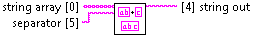

Join Strings.vi
===============

Concatenates substrings from the input array into one string. Specified delimiter is used to separate substrings.

**string array** *(Input, String, 1D Array)*
  Array of substrings to be concatenated.

**separator** *(Input, String)*
  Delimiter that separates substings in the final string.

**string out** *(Output, String)*
  Concatenated substrings separated by separator.

