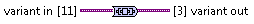

To Nested Variant.vi
====================

Substitutes two instances of ``To Variant`` function connected in serial.

**variant in** *(Input, Variant)*
  Your data.

**variant out** *(Output, Variant)*
  Your data encapsulated in `Variant` twice.

